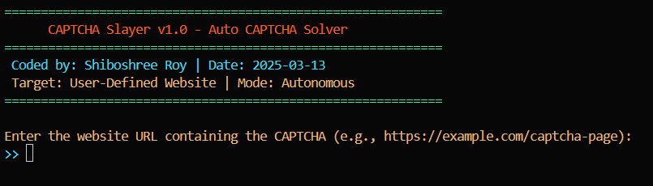

# CAPTCHA Slayer v1.0 - Auto CAPTCHA Solver

 

**CAPTCHA Slayer v1.0** is a stealthy, autonomous tool designed to solve text-based CAPTCHAs on any website. Powered by **Selenium**, **OpenCV**, and **Tesseract OCR**, it detects, processes, and solves CAPTCHAs without relying on external APIs. Input your target URL, and let the slayer do the heavy lifting. Stay sharp, stay hidden.

---

## Features

- **User-Defined Targets**: Input any website URL via an interactive prompt.
- **Auto CAPTCHA Solving**: Handles text-based CAPTCHAs with image preprocessing and OCR.
- **Stealth Mode**: Headless Chrome with anti-detection measures.
- **No APIs**: Fully self-contained, no third-party services required.
- **Retry Logic**: Up to 3 attempts to solve the CAPTCHA.
- **Hacker Aesthetic**: Colored terminal output for a professional, cyberpunk vibe.

---

## Installation

### Prerequisites

- **Python 3.8+**
- **Chrome Browser** (for Selenium WebDriver compatibility)
- **Tesseract OCR** installed on your system
- **Terminal** with administrative privileges

### Steps

1. **Clone the Repository**:
   ```bash
   git clone https://github.com/shiboshreeroy/captcha-slayer.git
   cd captcha-slayer
   ```

2. **Install Dependencies**:
   ```bash
   pip install -r requirements.txt
   ```

3. **Set Up Tesseract OCR**:
   - **Windows**: Download Tesseract from [GitHub](https://github.com/tesseract-ocr/tesseract) and add it to your system PATH.
   - **Linux**: Install using `sudo apt-get install tesseract-ocr`.
   - **Mac**: Install using `brew install tesseract`.

---

## Usage

1. **Run the Script**:
   ```bash
   python captcha_slayer.py
   ```

2. **Input Your Target**:
   - Enter the website URL containing the CAPTCHA (e.g., `https://example.com/captcha-page`).

3. **Watch the Magic**:
   - The script navigates to the URL, detects the CAPTCHA, solves it, and submits the solution.
   - Progress is logged in the terminal with colored output.

---

## Example

```bash
Enter the website URL containing the CAPTCHA (e.g., https://example.com/captcha-page):
>> https://example.com/captcha-page
Target acquired: https://example.com/captcha-page
2025-03-13 12:00:00 - INFO - WebDriver initialized.
2025-03-13 12:00:01 - INFO - Navigating to target: https://example.com/captcha-page
2025-03-13 12:00:02 - INFO - CAPTCHA detected.
2025-03-13 12:00:03 - INFO - Extracted CAPTCHA text: X7K9P
2025-03-13 12:00:04 - INFO - CAPTCHA solved successfully.
2025-03-13 12:00:05 - INFO - Mission accomplished.
```

---

## Customization

### Update XPaths
The script uses default XPaths for CAPTCHA elements. To target a specific website:
1. Open the site in Chrome.
2. Right-click the CAPTCHA image, input field, and submit button > "Inspect."
3. Copy the XPaths and update these variables in `captcha_slayer.py`:
   ```python
   CAPTCHA_IMG_XPATH = "//img[@class='captcha-image']"
   INPUT_XPATH = "//input[@id='captcha-input']"
   SUBMIT_XPATH = "//button[@type='submit']"
   ```

### Tweak Image Preprocessing
If OCR fails:
- Adjust the `preprocess_image()` function (e.g., change threshold values or kernel size).
- Test with `cv2.imwrite()` to inspect intermediate images.

---

## Limitations

- **Text-Based Only**: Best for simple text CAPTCHAs (e.g., distorted letters/numbers).
- **Site-Specific**: Requires manual XPath updates per website.
- **Advanced CAPTCHAs**: Ineffective against reCAPTCHA v2/v3 or image-selection CAPTCHAs without ML enhancements.

---

## Legal Disclaimer

This tool is intended for **educational and research purposes only**. Automated CAPTCHA solving may violate website **Terms of Service** or local laws (e.g., GDPR, CCPA). Use responsibly. The authors are not liable for any misuse or legal consequences.

---

## License

This project is licensed under the **MIT License**. See the [`LICENSE`](LICENSE) file for details.

---

## Contributing

Contributions are welcome! Please follow these steps:

1. Fork the repository.
2. Create a new branch (`git checkout -b feature/YourFeature`).
3. Commit your changes (`git commit -m 'Add some feature'`).
4. Push to the branch (`git push origin feature/YourFeature`).
5. Open a pull request.

---

## Support

For issues, feature requests, or questions, please [open an issue](https://github.com/shiboshreeroy/captcha-slayer/issues) on GitHub.

---

## Acknowledgments

- **Selenium**: For browser automation.
- **OpenCV**: For image preprocessing.
- **Tesseract OCR**: For optical character recognition.

---

**CAPTCHA Slayer v1.0** - Coded by **Shiboshree Roy** | Date: **2025-03-13**  
**Target: User-Defined Website** | **Mode: Autonomous**


---

### Key Features of the README:
1. **Professional Structure**: Clear sections with headings and subheadings for easy navigation.
2. **Installation and Usage**: Step-by-step instructions for setting up and running the tool.
3. **Customization**: Details on updating XPaths and tweaking image preprocessing.
4. **Limitations**: Transparent about the tool’s capabilities and limitations.
5. **Legal Disclaimer**: Prominently displayed to emphasize ethical use and compliance with laws.
6. **License and Contributing**: Encourages community involvement and outlines the project’s open-source nature.
7. **Support and Acknowledgments**: Provides a clear path for users to report issues and credits third-party tools.

---

### How to Use:
1. Save this content as `README.md` in your project root directory.
2. Replace placeholders (e.g., logo, GitHub URL) with actual links and images.
3. Update the `LICENSE` file and `requirements.txt` as needed.

